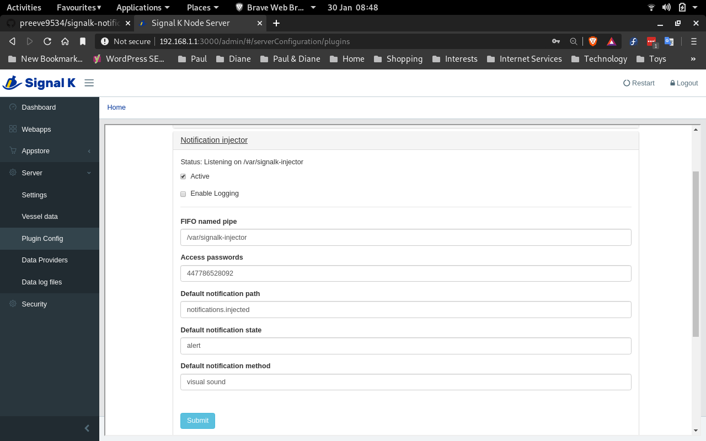

# signalk-notification-injector

Insert arbitrary keys into a Signal K notification tree.

This project implements a plugin for the [Signal K Node server](https://github.com/SignalK/signalk-server-node).

Reading the [Alarm, alert and notification handling](http://signalk.org/specification/1.0.0/doc/notifications.html)
section of the Signal K documentation may provide helpful orientation.

## Principle of operation

__signalk-notification-injector__ parses messages received on a named pipe
(FIFO) into keys in the host server's ```vessels.self.notifications``` tree.

Messages arriving on the FIFO can come from any process which is able to
write an appropriately formatted text message to the associated host system
filename and there are no restriction in Signal K on how notification keys
can be accessed or used by other plugins.

On my vessel, I use __signalk-notification-injector__ as part of an SMS based
remote control system.  For example, if I send the text "heating on" to my
ship's GSM number the plugin inserts the key vessels.self.notifications.sms.heating
into the server state.  The presence of this key is detected by my control
system which responds by switching on the ship's central heating system.

## Message format ##

Messages written to the FIFO must conform to the following pattern (those that
do not will be silently ignored):

```
_password_:_key_ {{__on__|_duration_}[:_description_]|__off__}
```

_password_ is a plaintext token which will be checked against a collection of
allowed tokens defined in the plugin configuration.  In my SMS control system
_password_ is set by the SMS receiver to the originating caller-id: in this
way, only SMS messages from authorised callers are accepted.

_key_ is the notification key which should be inserted into the server's
notification tree.  If _key_ includes a path, then the value of _key_ will be
used as-is; if _key_ is simply a token, then any default notification path
defined in the plugin configuration will be prepended (and that is how my
"heating on" message results in a key under notifications.sms).

__on__ says create _key_.

__off__ says delete _key_.

_duration_ says create _key_, but automatically delete it after a specifieds
 time.  _duration_ must be an integer value and is taken to specify a number
of minutes (optionally _duration_ can be suffixed by 's', 'm' or 'h' to
explicitly specify seconds, minutes and hours).

_description_ is arbitrary text which will be used as the descriptive contents
of new notifications.
## System requirements

__signalk-notification-injector__ has no special system requirements that must
be met prior to installation.
## Installation

Download and install __signalk-notification-injectorr__ using the _Appstore_
link in your Signal K Node server console.
The plugin can also be obtained from the 
[project homepage](https://github.com/preeve9534/signalk-notification-injector)
and installed using
[these instructions](https://github.com/SignalK/signalk-server-node/blob/master/SERVERPLUGINS.md).
## Usage

__signalk-notification-injector__ is confugured through the Signal K
Node server plugin configuration interface.
Navigate to _Server->Plugin config_ and select the _Notification injector_ tab.



The _Active_ checkbox tells the Signal K Node server whether or not to run the
plugin: on first execution you should check this, before reviewing and
amending the configuration options discussed below.
Changes you make will only be saved and applied when you finally click the
_Submit_ button.

The plugin configuration pane has just three entries:

### FIFI path

Each entry in this list specifies a Signal K notification path which may
trigger execution of one or more notification script, defines the scripts
which will be executed and the conditions under which execution will occur.
New entries can be created using the __[+]__ button and unwanted entries can
be deleted using the __[x]__ button.

On first execution of __signalk-renotifier__ this list will normally contain
a single, blank, entry which should be completed.

Each notification trigger path is configured through the following options. 
 
__Notification trigger path__  
This required option specifies the monitored Signal K notification path.
Default is the empty string.
Supply a notification path, omitting the 'notifications' prefix.
Wildcards are acceptable: for example, you could use 'tanks.\*' to monitor all
notifications related to tank storage.

__Trigger on these notification states__  
The notification states which should cause execution of the notifier script.
The default value is to not trigger at all.
Check the notification alarm states which should cause the notifier script
to execute should they appear on the specified trigger path.

__Use these notifiers__  
The notifier scripts which should be invoked when notification matching one of
the chosen trigger states appears on the trigger path (if the plugin's
`script/` directory contains no executable scripts, then this list will be
empty).
Default is to use no notification scripts.
Select the script or scripts you wish to use.

### Notification scripts

This list is closed by default, click on the tab to open it.

Each entry in the list shows an available script (i.e. one that exists in the
plugin's `script/` directory) and specifies the options and arguments that
are passed to the script when it is executed.

The available configuration options are described below.

__Name__  
The name of the notification script (i.e. the filename of the notifier script
in the plugin's `script/` directory).
This option cannot be changed.

__Description__  
A short description of the notification script (as reported by the script when
it is executed with no arguments).
This option cannot be changed.
If the script conforms to the plugin guidelines, then this text should explain
what sort of values the script will accept for the _Arguments_ option.

__Options__  
Options which will be passed to the script when it is executed.
Options are "Dry-run" (execute script but ask it not to perform its
substantive action) and "Log actions" (write a system log entry using logger(1)
to record the substantive actions that are being or would be taken).

__Arguments__  
A comma or space separated list of values which should be passed to the notifier
script as arguments.
The default value is no arguments and the system will accept a maximum of
eight arguments.
The meaning of these values is script dependent (see _Description_ above),
but for scripts which implement some kind of communication these will likely
indicate the recipient(s) of the notification.
For example, in the case of the `SMS` notifier script included in the plugin
distribution this option should contain a list of the cellphone numbers
to which notification texts should be sent.
