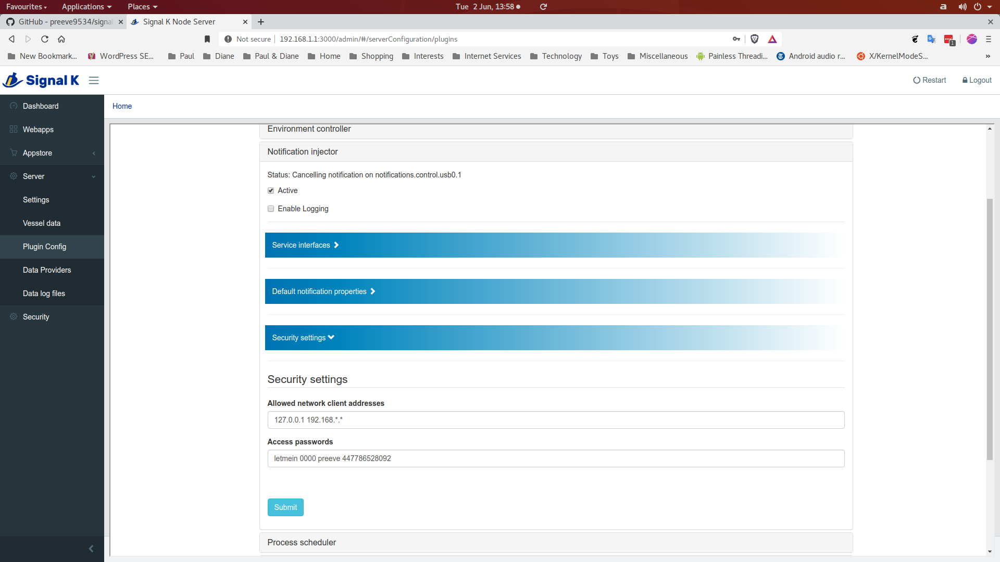

# signalk-notification-injector

Insert arbitrary keys into a Signal K notification tree.

This project implements a plugin for the [Signal K Node server](https://github.com/SignalK/signalk-server-node).

Reading the [Alarm, alert and notification handling](http://signalk.org/specification/1.0.0/doc/notifications.html)
section of the Signal K documentation may provide helpful orientation.

## Principle of operation

__signalk-notification-injector__ parses messages arriving on either a named
pipe (FIFO) or a websocket port into keys in the Signal K  host server's
```vessels.self.notifications``` tree.

Messages are single lines of text which conform to some simple formatting and
security rules.

Any local process which is able to write to the named pipe has access to the
injection process and creating a notification can be as simple as:
```
$> echo "letmein:heating on" > /var/signalk-injector
```

Remote processes or applications can achieve the same result by making a
WebSocket connection.

Signal K places no arbitrary restrictions on the semantics of notification keys
and it is a straightforward task to implement plugins which react to the
server's notification state.

## System requirements

__signalk-notification-injector__ has no special system requirements that must
be met prior to installation.
## Installation

Download and install __signalk-notification-injector__ using the _Appstore_
link in your Signal K Node server console.
The plugin can also be obtained from the 
[project homepage](https://github.com/preeve9534/signalk-notification-injector)
and installed using
[these instructions](https://github.com/SignalK/signalk-server-node/blob/master/SERVERPLUGINS.md).
## Configuration

__signalk-notification-injector__ is configured through the Signal K
Node server plugin configuration interface.
Navigate to _Server->Plugin config_ and select the _Notification injector_ tab.



The _Active_ checkbox tells the Signal K Node server whether or not to run the
plugin: on first execution you should check this, before reviewing and
amending the configuration options discussed below.
Changes you make will only be saved and applied when you finally click the
_Submit_ button.

The plugin configuration properties are organised under three collapsible tabs.

### Service interfaces

These properties define which, if any, of the possible plugin interfaces are
enabled and provide configuration details for each interface.
There are two sub-sections.

__FIFO named pipe -> Enabled?__ defines whether or not the local named pipe
will be monitored by the plugin.
Required.
Default is checked (monitor the named pipe).

__FIFO named pipe -> Path__ defines the absolute path of the named pipe.
Required.
Default is '/var/signalk-injector'.

__WebSocket -> Enabled?__ defines whether or not the plugin will accept TCP
websocket connections. 
Required.
Default is un-checked (do not accept websocket connections).

__Websocket -> Port__ defines the port number on which the plugin will listen.
Required.
Default is 6543.

### Notification defaults

These properties define what default values will be used by the plugin when it
constructs a notification from a received message.
Setting defaults is a way of simplifying the content of most incoming messages.
Defaults can always be over-ridden on a per-message basis.

__Default path__ defines the root in the notifications tree where the plugin
will place notifications which do not specify an absolute notification key
(that is a key which begins with 'notifications...').
The supplied path must be absolute (i.e. must begin with 'notifications.').
Required.
Default is 'notifications.injector'.

__Default state__ defines the value to be used for the notification state
field if no state is specified in a message.
Required.
Default value is 'alert'.

__Default method__ defines the values to be used for the notification method
field if no values are specified in a message.
Required.
The default value is to specify no methods.

### Access security

These properties define whether or not a simple keyword-based security check
should be applied to incoming messages.

__Perform access check on__ defines which communication interfaces will have a
security chcek applied to their incoming messages.
Required.
Default is to apply security checks to all interfaces.

__Passwords__ defines a space separated collection of keywords, one of which
must be included in messages presented to interfaces on which access checking
is enabled.
Required.
Default value is 'letmein 0000' and you should change this.  

## Usage

Once __signalk-notification-injector__ is configured, you can inject a key
into the Signal K notification tree by writing a line of text to the FIFO
or UDP port (if configured).
If configuration defaults are used, then:
```
$> echo "letmein:test on:This is a remotely injected test notification" > /var/signalk-injector
```
will insert the key ```notifications.injected.test```.

The notification can be cancelled by:
```
$> echo "letmein:test off" > /var/signalk-injector
```
Note that in Signal K world, cancelling a notification does not necessarily
result in removal of the associated key, but it does set the key value to
null.

You can check the Signal K server's notification state at any time by
substituting your server address in a url of the form:
```
http://192.168.1.1:3000/signalk/v1/api/vessels/self/notifications/
```

Each line of text received by the plugin will be parsed into a notification
as long as it conforms to some simple formatting rules and will otherwise be
silently ignored.  It is convenient to think of each text line as a message,
and the rules of message formatting are described below.

## Message format

Messages sent to the plugin must conform to the following pattern (those that
do not will be silently ignored):

_password_:_key_ {{__on__|_duration_}[:_description_][:_state_][:_methods_]|__off__}

_password_ is a plaintext token which will be checked against a collection of
allowed tokens defined in the plugin configuration.  In my SMS control system
_password_ is set by the SMS receiver to the originating caller-id: in this
way, only SMS messages from authorised callers are accepted.

_key_ is the key which should be inserted into the server's notification tree.
If _key_ includes a path, then the value of _key_ will be used as-is; if _key_
is simply a token, then the default notification path defined in the plugin
configuration will be prepended.

__on__ says create _key_.

__off__ says delete _key_ value.

_duration_ says create _key_, but automatically delete it after a specified
 time.  _duration_ must be an integer value and is taken to specify a number
of minutes (optionally _duration_ can be suffixed by 's', 'm' or 'h' to
explicitly specify seconds, minutes and hours).

_state_ defines the value of the new notification's state field.

_methods_ is a space-delimited list of values which will be used to define
the new notification's methods field.

_description_ is arbitrary text which will be used as the descriptive contents
of new notifications.

## Use cases

On _Beatrice_ I use __signalk-notification-injector__ as part of an SMS based
remote control system which allows me to do things like turn on lights and
heating and so on.

_Beatrice_'s cellular network interface is implemented by ```gammu-smsd```(1)
which periodically polls an attached GSM modem and acquires incoming texts.
Received texts are passed by ```gammu-smsd``` to a simple shell script which
parses the content into a message suitable for consumption by
__signalk-notification-injector__.

The ```[smsd]``` stanza of my ```gammu-smsd``` configuration file includes thes
 line:
```
RunOnReceive = /usr/local/bin/signalk-inject
```
which refers to the following ```bash```(1) script.
```
#!/bin/bash
# signalk-inject
FIFO=/var/signalk-injector
PROGRAM=/bin/echo

for i in `seq ${SMS_MESSAGES}` ; do
    eval "$PROGRAM \"\${SMS_${i}_NUMBER}\":\"\${SMS_${i}_TEXT}\"" > ${FIFO}
done

```
